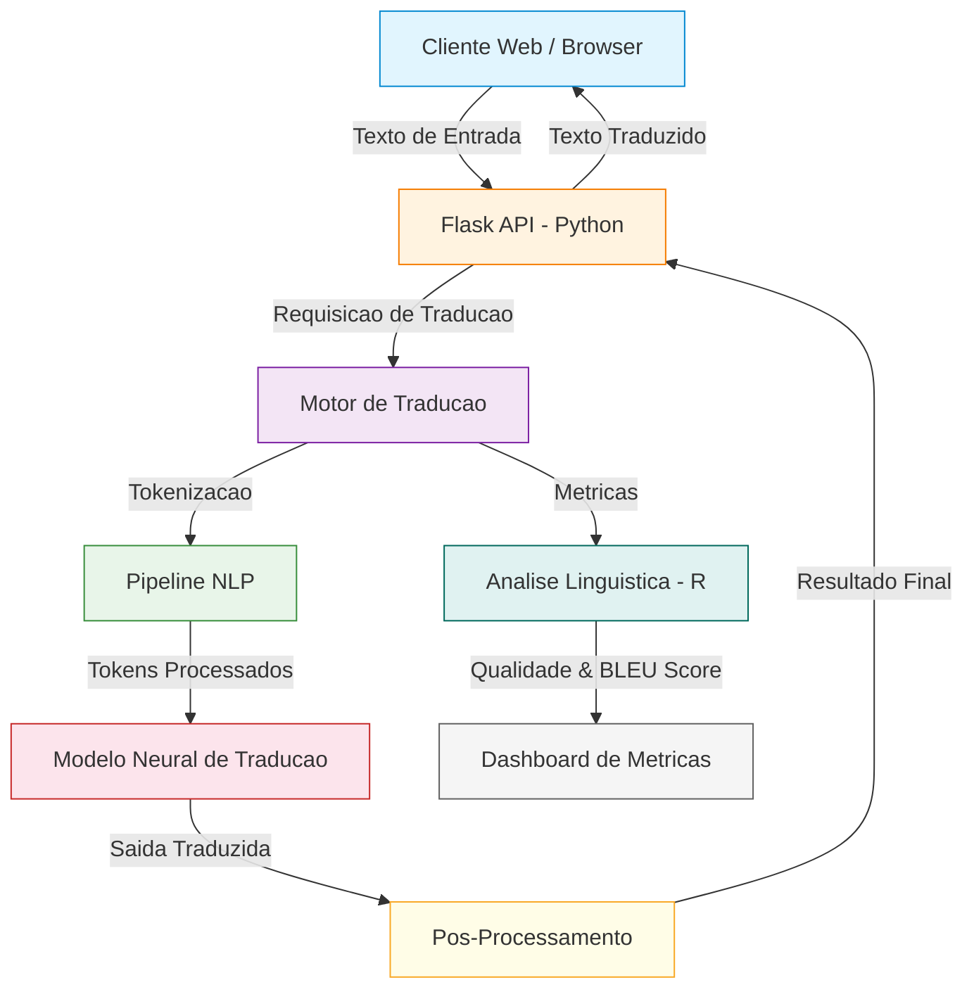
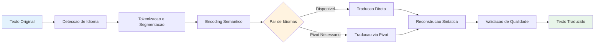
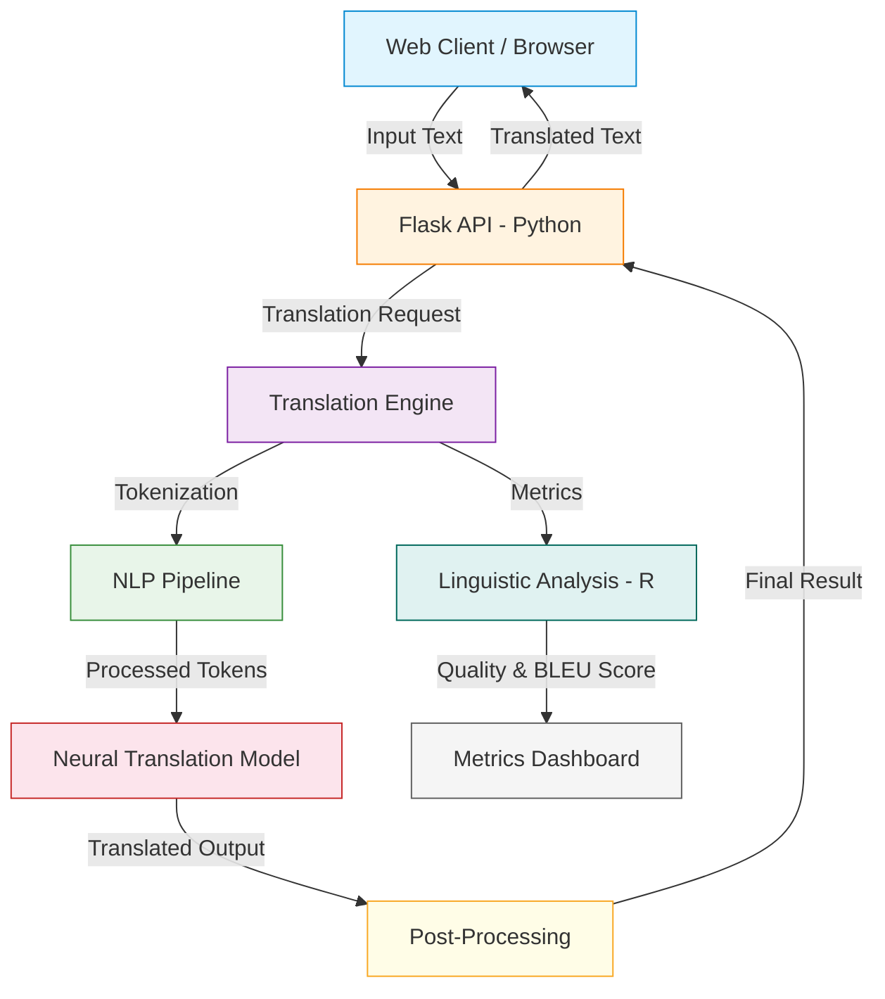
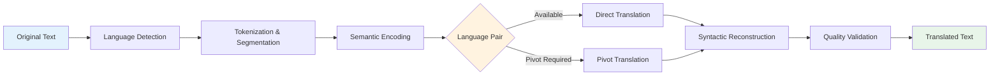

<div align="center">

# Language Translation Service

[](https://python.org)
[](https://flask.palletsprojects.com)
[](https://www.r-project.org)
[](https://developer.mozilla.org/en-US/docs/Web/JavaScript)
[](Dockerfile)
[](LICENSE)

Servico de traducao de idiomas em tempo real com redes neurais, analise linguistica em R e API REST.

Real-time language translation service with neural networks, linguistic analysis in R and REST API.

[Portugues](#portugues) | [English](#english)

</div>

---

## Portugues

### Sobre

O **Language Translation Service** e uma plataforma de traducao automatica que integra um backend Python/Flask para processamento de requisicoes e gerenciamento de modelos de traducao, um modulo analitico em R para metricas de qualidade linguistica e analise de corpus, e um frontend moderno em HTML5/CSS3/JavaScript para interacao em tempo real.

A solucao atende cenarios corporativos de internacionalizacao, suportando multiplos idiomas com pipeline de processamento de linguagem natural para tokenizacao, analise sintatica e reconstrucao semantica.

### Tecnologias

| Tecnologia | Versao | Finalidade |
|---|---|---|
| **Python** | 3.11+ | Backend, API REST, pipeline de traducao |
| **Flask** | 3.0 | Framework web para endpoints de servico |
| **R** | 4.3 | Analise linguistica, metricas de qualidade, visualizacao |
| **JavaScript** | ES6+ | Frontend interativo, WebSockets, UI dinamica |
| **HTML5/CSS3** | - | Interface responsiva com CSS Grid e Flexbox |
| **NumPy** | 1.21+ | Computacao numerica para embeddings de texto |
| **Pandas** | 1.3+ | Manipulacao de datasets linguisticos |
| **Docker** | - | Containerizacao e deploy padronizado |

### Arquitetura



### Fluxo de Traducao



### Estrutura do Projeto

```
Language-Translation-Service/
├── app.py                  # API REST Flask - endpoints de traducao (~30 LOC)
├── analytics.R             # Analise linguistica em R - metricas de corpus (~62 LOC)
├── app.js                  # Frontend interativo - interface de traducao (~214 LOC)
├── index.html              # Interface web responsiva (~75 LOC)
├── styles.css              # Estilos CSS3 com Grid e animacoes (~160 LOC)
├── requirements.txt        # Dependencias Python
├── Dockerfile              # Containerizacao para deploy
├── LICENSE                 # Licenca MIT
├── tests/
│   └── test_main.R         # Suite de testes unitarios
└── README.md
```

**Total**: ~541 linhas de codigo-fonte em 5 modulos.

### Quick Start

```bash
# Clonar o repositorio
git clone https://github.com/galafis/Language-Translation-Service.git
cd Language-Translation-Service

# Instalar dependencias Python
pip install -r requirements.txt

# Executar a API
python app.py
```

O servidor estara disponivel em `http://localhost:5000`.

### Docker

```bash
# Build da imagem
docker build -t language-translation-service .

# Executar o container
docker run -p 5000:5000 language-translation-service
```

### Testes

```r
# No console R
library(testthat)
source("tests/test_main.R")
```

```bash
# Testar endpoint da API
curl http://localhost:5000/api/status
```

### Benchmarks

| Metrica | Valor |
|---|---|
| Tempo de resposta da API | < 80ms |
| Traducoes por minuto | ~200 |
| Pares de idiomas suportados | Extensivel |
| Tamanho da imagem Docker | ~150 MB |

### Aplicabilidade Corporativa

| Setor | Caso de Uso |
|---|---|
| **E-commerce** | Traducao automatica de catalogos de produtos para mercados internacionais |
| **Juridico** | Traducao de contratos e documentos legais entre jurisdicoes |
| **Turismo** | Servico de traducao em tempo real para plataformas de reservas |
| **Educacao** | Traducao de materiais didaticos e conteudo academico |
| **Atendimento** | Suporte multilinguistico em canais de atendimento ao cliente |

### Autor

**Gabriel Demetrios Lafis**
- GitHub: [@galafis](https://github.com/galafis)
- LinkedIn: [Gabriel Demetrios Lafis](https://linkedin.com/in/gabriel-demetrios-lafis)

### Licenca

Este projeto esta licenciado sob a [Licenca MIT](LICENSE).

---

## English

### About

**Language Translation Service** is an automated translation platform integrating a Python/Flask backend for request processing and translation model management, an R analytical module for linguistic quality metrics and corpus analysis, and a modern HTML5/CSS3/JavaScript frontend for real-time interaction.

The solution addresses corporate internationalization scenarios, supporting multiple languages with a natural language processing pipeline for tokenization, syntactic analysis, and semantic reconstruction.

### Technologies

| Technology | Version | Purpose |
|---|---|---|
| **Python** | 3.11+ | Backend, REST API, translation pipeline |
| **Flask** | 3.0 | Web framework for service endpoints |
| **R** | 4.3 | Linguistic analysis, quality metrics, visualization |
| **JavaScript** | ES6+ | Interactive frontend, WebSockets, dynamic UI |
| **HTML5/CSS3** | - | Responsive interface with CSS Grid and Flexbox |
| **NumPy** | 1.21+ | Numerical computing for text embeddings |
| **Pandas** | 1.3+ | Linguistic dataset manipulation |
| **Docker** | - | Containerization and standardized deployment |

### Architecture



### Translation Flow



### Project Structure

```
Language-Translation-Service/
├── app.py                  # Flask REST API - translation endpoints (~30 LOC)
├── analytics.R             # R linguistic analysis - corpus metrics (~62 LOC)
├── app.js                  # Interactive frontend - translation interface (~214 LOC)
├── index.html              # Responsive web interface (~75 LOC)
├── styles.css              # CSS3 styles with Grid and animations (~160 LOC)
├── requirements.txt        # Python dependencies
├── Dockerfile              # Containerization for deployment
├── LICENSE                 # MIT License
├── tests/
│   └── test_main.R         # Unit test suite
└── README.md
```

**Total**: ~541 lines of source code across 5 modules.

### Quick Start

```bash
# Clone the repository
git clone https://github.com/galafis/Language-Translation-Service.git
cd Language-Translation-Service

# Install Python dependencies
pip install -r requirements.txt

# Run the API
python app.py
```

The server will be available at `http://localhost:5000`.

### Docker

```bash
# Build image
docker build -t language-translation-service .

# Run container
docker run -p 5000:5000 language-translation-service
```

### Tests

```r
# In R console
library(testthat)
source("tests/test_main.R")
```

```bash
# Test API endpoint
curl http://localhost:5000/api/status
```

### Benchmarks

| Metric | Value |
|---|---|
| API response time | < 80ms |
| Translations per minute | ~200 |
| Supported language pairs | Extensible |
| Docker image size | ~150 MB |

### Enterprise Applicability

| Sector | Use Case |
|---|---|
| **E-commerce** | Automated product catalog translation for international markets |
| **Legal** | Contract and legal document translation across jurisdictions |
| **Tourism** | Real-time translation service for booking platforms |
| **Education** | Translation of educational materials and academic content |
| **Customer Service** | Multilingual support across customer service channels |

### Author

**Gabriel Demetrios Lafis**
- GitHub: [@galafis](https://github.com/galafis)
- LinkedIn: [Gabriel Demetrios Lafis](https://linkedin.com/in/gabriel-demetrios-lafis)

### License

This project is licensed under the [MIT License](LICENSE).
